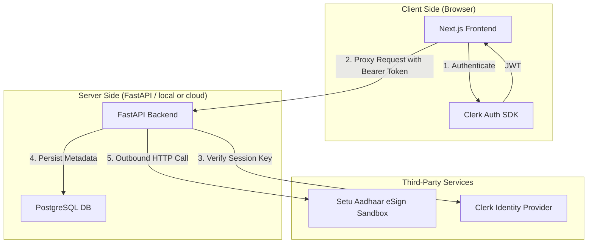
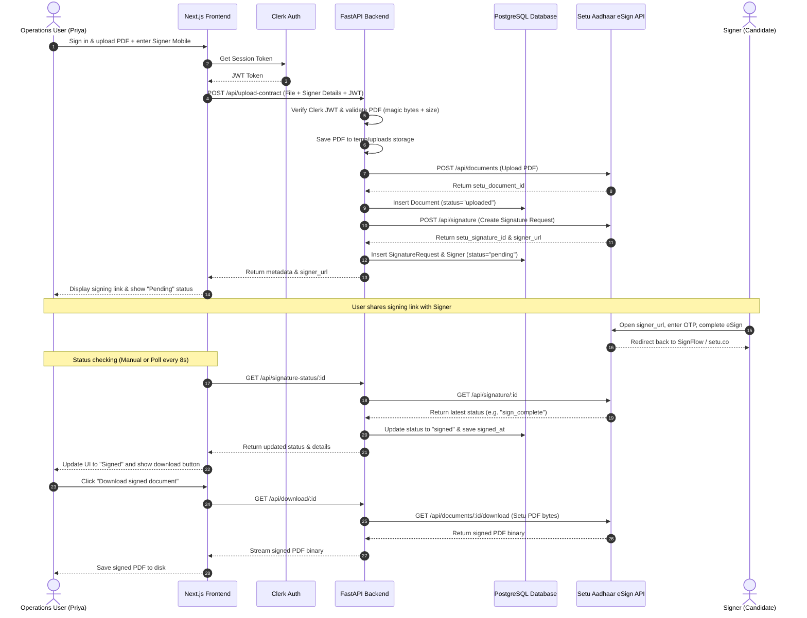

# SignFlow

> A Setu-powered contract upload and Aadhaar eSign platform. Upload a PDF, send it for legally valid e-signature, track status in real time, and download the signed document — all through a clean, self-serve interface.

---

## System Architecture



The frontend **never** communicates with Setu directly. All API calls — upload, create signature request, check status, download — are proxied through the FastAPI backend. Setu credentials live only in the backend `.env` and are never exposed to any client.

---

## E2E Sequence Diagram



---


## Tech Stack

| Layer | Choice | Why |
|---|---|---|
| Backend | FastAPI (Python) | Async-native; built-in Pydantic validation; auto-generated OpenAPI docs |
| Frontend | Next.js 15 (TypeScript) | App Router; file-based routing; trivial Vercel deployment |
| Database | PostgreSQL | Relational integrity for documents → signature requests → signers |
| ORM / Migrations | SQLAlchemy + Alembic | Versioned migrations; `alembic upgrade head` setup |
| Auth | Clerk (magic-link) | Passwordless — no password database to leak; hosted provider |
| HTTP Client | httpx | Async-native; used for all Setu API calls in the backend |

---

## Repository Structure

```
signflow/
├── backend/          # FastAPI app, Setu integration, DB models
├── frontend/         # Next.js app, UI components, design system
├── docs/             # All spec and architecture documents
└── README.md
```

---

## Quick Start

### Backend

```bash
cd backend
python -m venv venv && venv\Scripts\activate   # Windows
pip install -r requirements.txt
cp .env.example .env                            # fill in credentials
alembic upgrade head
uvicorn app.main:app --reload
# → http://localhost:8000/docs
```

### Frontend

```bash
cd frontend
npm install
cp .env.local.example .env.local               # fill in API URL + Clerk key
npm run dev
# → http://localhost:3000
```

---

## Database Schema

Three tables reflect the real-world relationship: a document is uploaded once; a signature request is created for it; each request has one or more signers.

```
documents (1) ──── (1..n) signature_requests (1) ──── (1..n) signers
```

| Table | Key fields |
|---|---|
| `documents` | `id`, `setu_document_id`, `owner_id`, `original_filename`, `file_path`, `uploaded_at` |
| `signature_requests` | `id`, `document_id`, `setu_signature_id`, `status`, `created_at`, `updated_at` |
| `signers` | `id`, `signature_request_id`, `identifier` (mobile), `signer_url`, `status`, `signed_at` |

Full schema: [`docs/Technical_Architecture_SignFlow.md`](docs/Technical_Architecture_SignFlow.md)

---

## Security Considerations

- **Credentials server-side only** — Setu's `x-client-id`, `x-client-secret`, and `x-product-instance-id` exist only in `backend/.env`. They are never referenced in any frontend file and never returned in any API response.
- **Unguessable signing links** — every signing link uses a long random token, not a sequential ID. Guessing `/status/2` does not expose another user's contract.
- **Row-level ownership** — every database query filters on `owner_id` (the authenticated Clerk user). No query path can return another user's documents.
- **CORS locked to one origin** — the backend only accepts requests from `FRONTEND_URL`. Wildcard (`*`) is never used.
- **Content-type validation** — uploaded files are validated by magic bytes (`%PDF-`), not just extension.
- **No raw errors to the client** — a global exception handler ensures stack traces and DB errors never reach the browser.

### Secrets in production

For this assignment, secrets live in the platform's encrypted environment variable store (Render / Railway built-in). In a production system they would move to a dedicated secrets manager (AWS Secrets Manager, HashiCorp Vault, or Doppler) with automatic rotation and audit logging. The `SETU_WEBHOOK_SECRET` placeholder in `.env.example` shows where webhook verification would be added.

---

## Docs

| Document | Description |
|---|---|
| [PRD](docs/PRD_SignFlow.md) | Product requirements, personas, MVP scope |
| [Technical Architecture](docs/Technical_Architecture_SignFlow.md) | Stack, folder structure, DB schema, env vars |
| [Frontend Specification](docs/Frontend_Specification_SignFlow.md) | Design system, components, Setu API shapes |
| [Security & Access](docs/Security_and_Access_SignFlow.md) | Auth, roles, RLS, error handling, edge cases |
| [Feature Tickets](docs/Feature_Tickets_SignFlow.md) | Ordered build tickets with acceptance criteria |
| [Build Plan](docs/Build_Plan_and_Agent_Prompt_SignFlow.md) | Commit discipline and agent workflow |

---

## Deployment

| Service | Platform | Notes |
|---|---|---|
| Backend | Render / Railway | Free tier; spins down on inactivity — mention in demo |
| Frontend | Vercel | Zero-config Next.js deploys |
| Database | Neon / Railway Postgres | Free tier sufficient for assignment scale |
